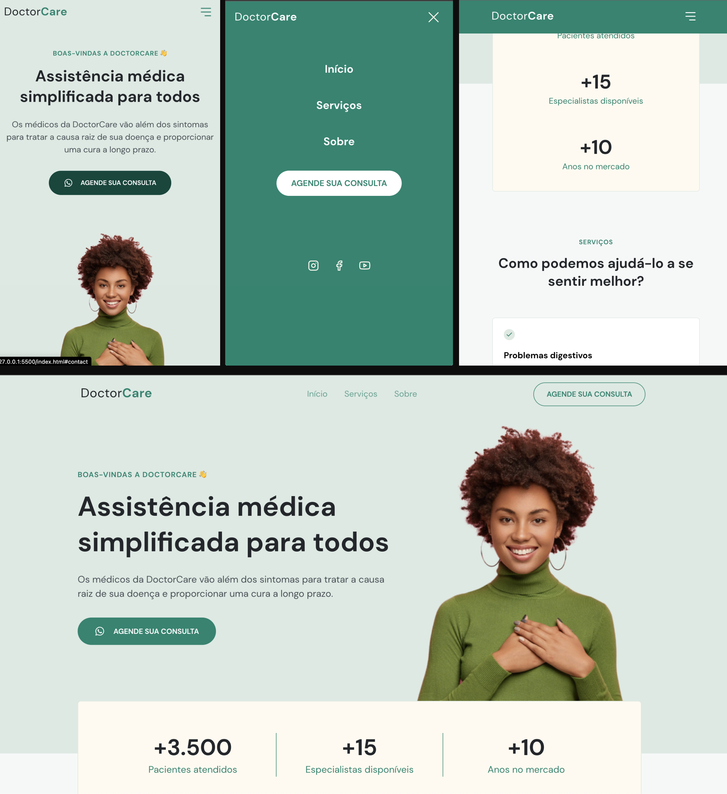

# Landing Page 1

  

## Sobre o projecto

A ideia do projecto é:

Uma landing page, por padrão é uma única página Web que aparece em resposta a clicar em um resultado de pesquisa otimizado para mecanismo de pesquisa, promoção de marketing, e-mail de marketing ou anúncio on-line.

Neste projecto foi desenvolvida uma landing page que auxilia na promoção e divulgação dos serviços de uma clínica de saúde

## Funcionalidades

- A Página encontra-se responsiva e adaptável para qualquer dispositivo móvel.

- É possível agendar uma consulta entrando em contacto com a clínica via WhatsApp

## Tecnologias

- Html
- CSS
- Javascript

